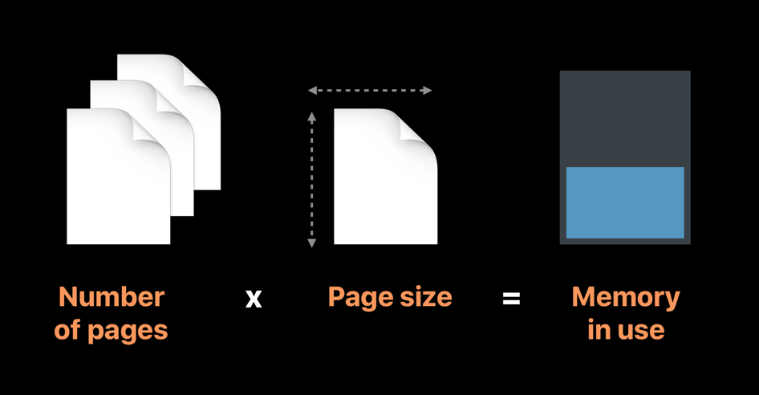
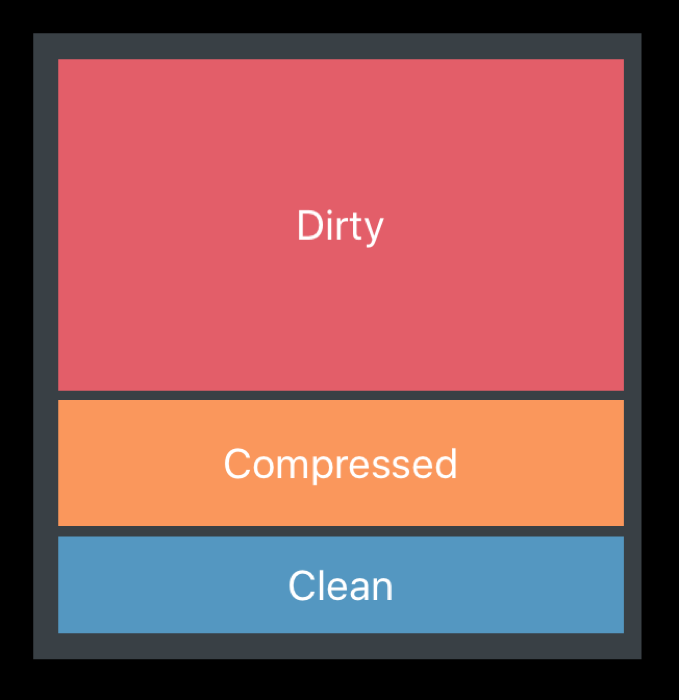
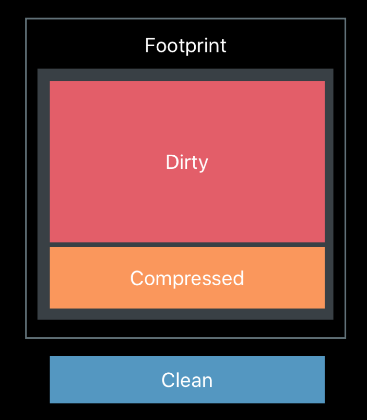

The Virtual Memory manager creates a logical address space (or “virtual” address space) for each process and divides it up into uniformly-sized chunks of memory called **pages**. 

Pages holds multiple object in the heap such as _UIView_, _UILabel_, _String_, _Data_ etc., Some object can extend to more than one page. These pages are typically ___16Kb___ in size.

The memory use of the application depends on the number of pages and its page size.

<!--  -->

### Typical memory profile of an app:
-   Clean memory
-   Dirty memory
-   Compressed memory

<!--  -->

### Clean memory:

- Memory mapped files are files present in disk that are loaded into memory. 
- If the memory mapped files (can be _image.jpg_, _blob.data_, _Training.model_, _Frameworks_) are read-only, then they it will always be as Clean pages. 
- Kernel manages when the files comes in and out of the RAM.

### Dirty memory:

- Dirty memory is any memory that are written by an app. 
- Dirty memory will be utilized by all heap allocation objects such as _malloc_, _Array_, _NSCache_, _UIViews_, _String_ and decoded image buffers such as _CGRasterData_, _ImageIO_ and _Frameworks_. 
- This dirty memory can be reduced by usage of Singleton classes and Global initializers.

### Compressed memory:

Compressed memory will compress and store the unaccessed pages. Memory compressor is used to store & retrieve compressed memory. 

Memory compressor performs 2 actions:
-   Compresses unaccessed pages
-   Decompresses pages upon access

Sometimes compressor complicates freeing memory. _NSCache_ is thread safe, can be preferred over _Dictionary_. 

### Memory Footprint Limits:

<!--  -->

- Only Dirty and Compressed memory contributes to high memory footprint. 
- Limits vary from device to device. 
- Applications will have fairly high memory footprint limits whereas Extensions will have much lower limit. 
- EXC_RESOURCE_EXCEPTION will occur if footprint limit is exceeded.
