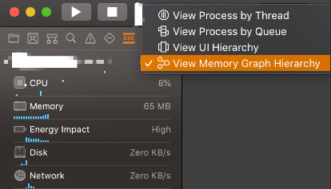
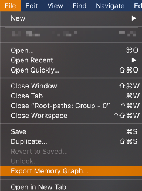
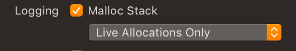

iOS Memory Footprint can be measured by Xcode Memory gauge and can be investigated by Instruments.

## Xcode Memory gauge:

Xcode memory gauge is used to view the memory footprint of the app. It is present in Xcode debug navigator.

## Instruments:

Instruments provides number of ways to investigate the memory footprint of the app.

-	Allocations
-	Leaks
-	VM Tracker
-	Virtual memory trace

### Allocations:

Allocations check the various heap allocations of the app

### Leaks:

Leaks provides the memory leaks in the process over time

### VM Tracker:

VM Tracker provides the memory allocation information in Dirty size, Swapped (Pre-Compressed) size and Resident size. It is useful to identify the dirty size of the app

### Virtual memory trace:

Virtual memory trace provides the deep view of performance of virtual memory. It provides the operations of system profile such as Page cache hits, zero fill etc., in the instruments 

Once EXC_RESOURCE_EXCEPTION exception occurs the memory allocation can be view from the Memory debugger. Memory Graph Hierarchy can be viewed from the debugger. 

<!--  -->

To investigate further, the memory graph has to be exported from the project. Memory graph can be exported from _File -> Export Memory graph_

<!--  -->

Once _abc.memgraph_ is exported. We can investigate it further using XCode command line tools such as _vmmap, leaks, heaps_, _malloc-history_.

#### vmmap: 

Shows virtual memory regions allocated in a process

`vmmap abc.memgraph`

`vmmap –-summary abc.memgraph`

-   The summary flags provides the sizes in virtual memory region such as virtual size, resident size, dirty size, swapped size etc., Dirty and swapped size are important that contributes to the memory footprint.

##### vmmap and AWK:

`vmmap –page abc.memgraph | grep ‘.dylib’ | awk ‘{ sum += $6 } END { print “Total dirty pages: ”sum}‘`

-   The above code prints the total dirty pages of the dynamic library in the app.

#### leaks:

Shows objects that are allocated, but no longer referenced and also shows routine cycle to which the leaks belong to. Tracks objects in heap that are not rooted in runtime. So Leaks are dirty memory that can never be freed.

`leaks abc.memgraph`

-   If malloc stack logging is enabled in the process, it also shows the backtrace to the root node. Malloc logging can be enabled from _Edit Scheme -> Run -> Diagnostics_

<!--  -->

#### heap:

Shows object allocated on the process heap and used for identifying large objects in memory and what allocated it.

`heap abc.memgraph`

  - Provides information about the class_name, count of its occurrence, total size and average size etc., 

`heap -–sortBySize abc.memgraph`

-   Sorts the heap information (class_name, count, size etc.,) by size

`heap –address [class_name] abc.memgraph`

eg: heap –address NSConcreteData abc. Memgraph

-   If address flag is passed along with the name of the class, it will give the each instance of the class in heap

#### malloc_history:

To use malloc_history command line tool, malloc stack tracking should be enabled.

`malloc_history abc.memgraph [address]`

-   Provides the backtrace for the given address for instance in memory, if backtrace is captured.

From the backtrace, the function/class which causes the huge memory allocation can be identified and managed better.
