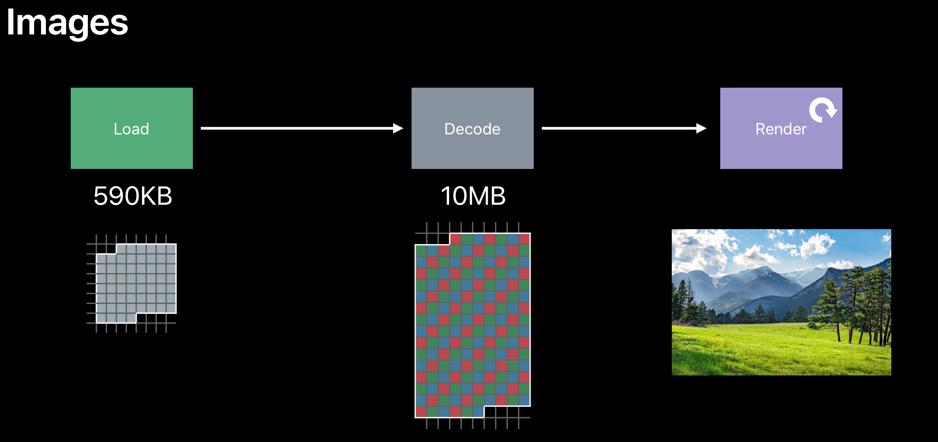

The memory usage of the image depends on its dimension (2034*1600) not its file size (600kb)

Memory usage of an image can be calculated as follows,

Memory = width in pixels * height in pixels * 4 byte per pixel

So our memory will be, 

Memory = 2034 * 1600 * 4 =  **13.02 MB**


## Why do images occupy such memory space?

In iOS, 3 phases are involved to render an image in app. The phases are Load, Decode & Render



### Load:

Loads the compressed .jpg, .png file into the memory

### Decode:

Decodes/uncompress the image into GPU readable format, which in turn occupies more memory than its files size

### Render:

Renders the image into the app

## Image Formats:

The following are the image formats,

-   SRGB Format (4 byte/pixel)
-   Wide Format (8 byte/pixel)
-   Luminance & alpha 8 format (2 byte/pixel)
-   Alpha 8 format (1 byte/pixel)

To choose the right format for the app,

-   Don’t use _UIGraphicsBeginImageContextWithOptions_, it occupies 4 bytes per pixel by default
-   Use _UIGraphicsImageRenderer_, automatically picks best graphics format in iOS 12

Eg: To Draw circle using _UIGraphicsImageRenderer_ – allocates only 1 byte per pixel

``` Swift
let bounds = CGRect(x: 0, y: 0, width:300, height: 100)
let renderer = UIGraphicsImageRenderer(size: bounds.size) 

let image = renderer.image { context in 
// Drawing Code 
UIColor.black.setFill() 

let path = UIBezierPath(roundedRect: bounds, byRoundingCorners: UIRectCorner.allCorners, cornerRadii: CGSize(width: 20, height: 20)) 

path.addClip() 
UIRectFill(bounds) 
} 

// Make circle render blue, but stay at 1 byte-per-pixel image 
let imageView = UIImageView(image: image) 
imageView.tintColor = .blue 
```

## Image Resizing:

_UIImage_ is non-efficient in resizing images. It will compress original image to memory and its internal coordinate space transforms are expensive

_ImageIO_ is efficient in resizing images. It can read image size & metadata information without dirtying the memory.

``` Swift
//Resizing image using ImageIO - Efficient
       
let file = "path/image.jpg"

let url = NSURL(fileURLWithPath: file)
        
let imageSource = CGImageSourceCreateWithURL(url, nil)

let properties = CGImageSourceCopyPropertiesAtIndex(imageSource, 0, nil)

let options :[NSString:Any] = [
            kCGImageSourceThumbnailMaxPixelSize:100,
kCGImageSourceCreateThumbnailFromImageAlways:true ]
        
let scaledImage = CGImageSourceCreateThumbnailAtIndex(imageSource, 0, options)
```

Images should be loaded only if the app presents the image. Unload the images when the app is off-screen using App lifecycle such as _UIApplicationWillEnterForeground_ and _UIApplicationDidEnterBackground_ notifications.


Also unload images using _UIViewController_ lifecycle methods such as 
_viewWillAppear_ and _viewDidDisappear_.
