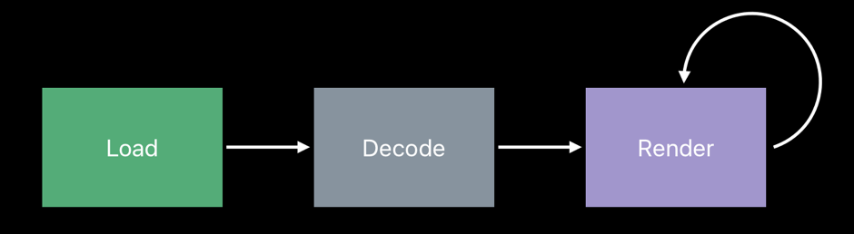
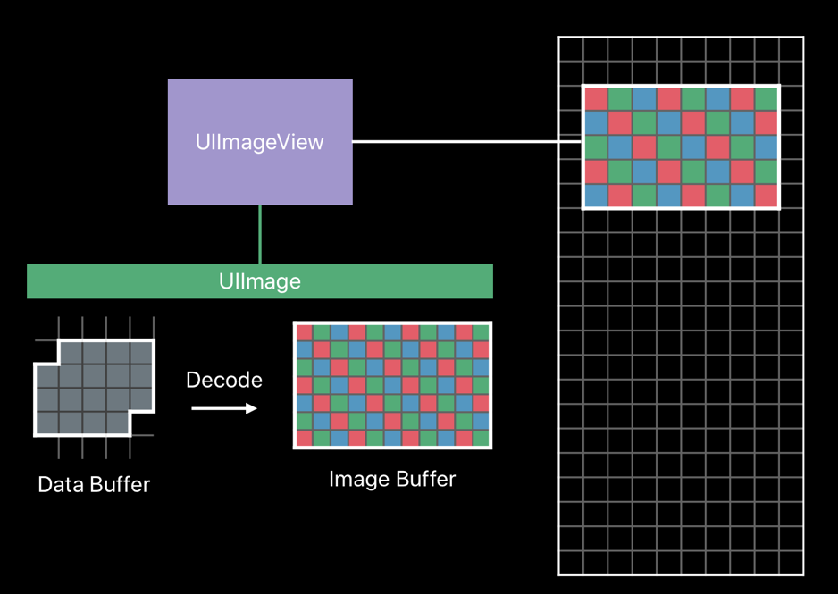
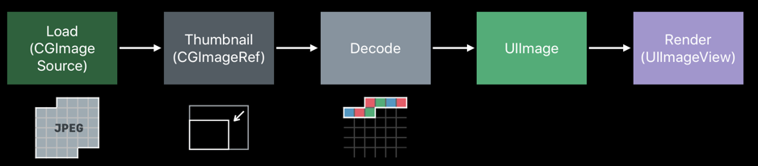
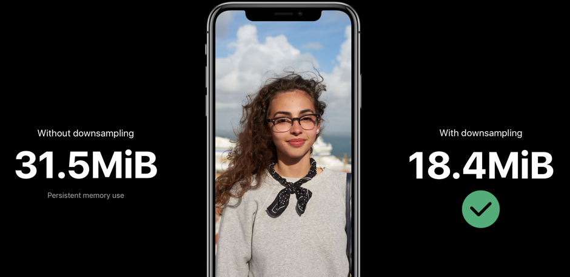

Image rendering pipeline involves Load, Decode and Render as mentioned in [Part 1](/blog/optimizing-images-to-reduce-memory-consumption-part-1).



Rendering is a continuous phase. It is important to consider decoding to measure the performance. Image Buffers retains the pixels of the image while decoding.

### Image buffer:

It is the in-memory representation of the image. Each element in the buffer describes the color and transparency of single pixel in the image. The buffer size is proportional to the size of the image.


### Frame buffer:

Frame buffer holds the actual rendered output of the application.
As application view hierarchy updates, _UIKit_ will render the application’s window and all of its subviews into the frame buffer. The frame buffer provides the per pixel information that the display hardware will read to render the pixel on the display. The render happens at fixed interval (60-120Hz)

### Data buffer:

Data buffers contains image file. It is buffer which contains the sequences in bytes. Image itself will be encoded in JPEG, PNG and other compressed forms. Its metadata describes the image dimensions. Bytes do not directly represent pixel of the image.

### Downsampling Images:

The _UIImageView_ size will be smaller when compared to the UIImage that is required to be render inside it. Usually CoreAnimation will shrink the image into _UIImageView_. By using downsampling we can save memory



Downsampling shrinks the UIImage and decodes the shrinked image from Image buffer. This shrinked image can be used always to render into _UIImageView_. We can discard the original data buffer of the image, to save the memory.



``` Swift
//Downsampling large images for display at smaller size
    func downSample(imageAt imageURL:URL, to pointSize :CGSize, scale:CGFloat) -> UIImage {
        let imageSourceOptions = [kCGImageSourceShouldCache:false] as CFDictionary
        let imageSource = CGImageSourceCreateWithURL(imageURL as CFURL, imageSourceOptions)!
        
        let maxDimensionInPixels = max(pointSize.width, pointSize.height) * scale
        let downSampleOptions = [kCGImageSourceCreateThumbnailFromImageAlways:true, kCGImageSourceShouldCacheImmediately: true, kCGImageSourceCreateThumbnailWithTransform: true, kCGImageSourceThumbnailMaxPixelSize:maxDimensionInPixels] as CFDictionary
        
        let downSampleImage = CGImageSourceCreateThumbnailAtIndex(imageSource, 0, downSampleOptions)!
        return UIImage(cgImage: downSampleImage)
    }
```

A sample downsampling example is as follows, 



By performing optimization using the downsampling technique we can drastically reduce the memory consumed by the image, which in turn will improve the performance of the app. 
