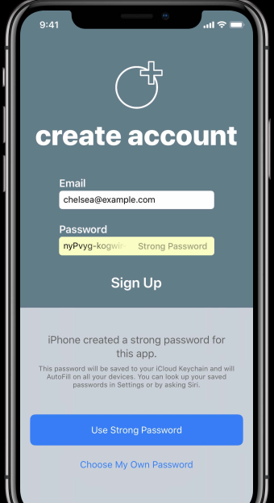

### iOS Strong Password

From iOS 12, strong password can be recommended whenever a new user sign up to iOS application. It is a simple and straight forward approach to implement this feature in your iOS application.

### Autofill Strong password
A strong password can be autofilled to your password textfield by specifying its contentType as `.newPassword`

``` Swift
passwordTxtField.contentType = .newPassword
```

This strong passwords are usually 20 characters long. It can contains more than 71 bits of entropy. By default, password generation rule includes _lowercase, uppercase, digits, hypen_ 



The password generation rules can be customized for your app. The rule can be created and validated from [Password rules validation tool](https://developer.apple.com/password-rules/) 

A sample implementation of strong password autofill using custom password generation rule is as follows,

``` Swift
let passwordTxtField = UITextField()
let rulesDescriptor = "required: lower; required: upper; required: digit; required: [-,_]; minlength: 20; maxlength: 8;"
passwordTxtField.passwordRules = UITextInputPasswordRules(descriptor:rulesDescriptor)
```
